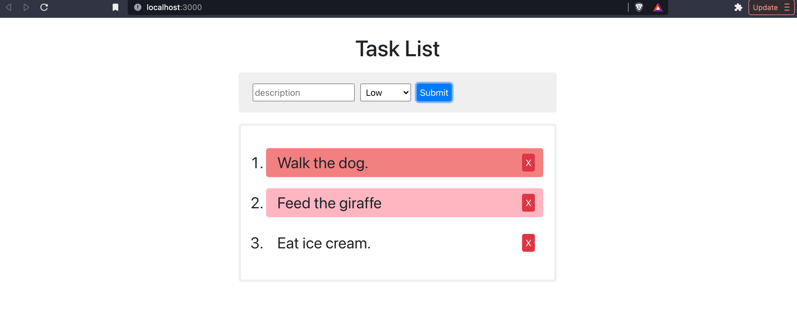

# State Exercise



## Exercise Overview

In this exercise we will be building a task list that will allow users to write a list of things they want to remember to do. They should be able to add new items and remove existing items from the list. They should be able to set an importance level: low, medium, or high, and this should effect the background color of each task.

## Set Up And Run A New React App

1. Open the terminal to the `exercise` directory--the simplest way to do so is to right-click on the `exercise` folder in VS Code and select "Open in Integrated Terminal".

2. In the terminal, type `npm create vite .` and hit enter/return. The `.` is important--this will create a new Vite project in the current directory.

3. It will warn you that there are files here currently. Use the arrow keys and Enter/Return to select "Ignore files and continue". This allows us to keep our readme and any data/assets files we have in our new project folder.

4. Choose React and then JavaScript from the following menus, using arrow keys and Enter/Return.

5. Install dependencies by entering `npm install` in the terminal.

6. Run the app by typing `npm run dev` in the terminal. This will provide a clickable link to open the app in your default browser, or you can navigate to the localhost URL in your browser.

## Exercise Assets

7. Move the image files from the `assets` directory outside the project directory into the directory `public`, so that the images will be accessible to your application.

## Install Bootstrap

8. Next let's import Bootstrap, a front-end framework that provides CSS code to make our project beautiful. In your terminal, type `npm install bootstrap@5.2.3`. This will install the package into our project.

## Import Bootstrap

9. Then, in VS Code, open the **/src/main.jsx** file and import the bootstrap css styles by typing the following line `import 'bootstrap/dist/css/bootstrap.css';` placing it just after the import of ReactDOM and just before our import of **index.css**.

## Creating the App Component

10. Open **/src/App.jsx**. This file is an example component that React starts with. You can delete everything in this file.

11. Next, create the boiler plate code for a functional component (including importing React and exporting the function). Name the function `App`.

```jsx
import React from 'react';

function App() {
  return (  );
}

export default App;
```

12. Fill the empty return statement with the following elements:

```jsx
<div className="container">
  <div className="row">
    <div className="col-12">
      <h1>Task List</h1>
      {/* Add Task form will go here... */}
    </div>
  </div>
  <div className="row">
    <div className="col-12">
      <ol> {/* Task list goes here... */} </ol>
    </div>
  </div>
</div>
```

## Create AddTask component

13. From the File Explorer from the left side panel, **right click** in the **/src/** folder and select **New File**. Name the file `AddTask.jsx`.

14. Open the **/src/AddTask.jsx** file and create the basic functional component scaffolding. Name the component `AddTask`.

15. Fill the empty return statement the following elements:

```jsx
<form>
  <input type="text" name="description" placeholder="description" required />
  <select name="importance">
    <option value="low"> Low </option>
    <option value="medium"> Medium </option>
    <option value="high"> High </option>
  </select>
  <button type="submit" className="btn btn-primary">
    Submit
  </button>
</form>
```

Here we created a form with a text input for the task description, a select menu with the different options for importance level, and lastly a submit button.

16. Save this file and head back to **/src/App.jsx** and after the React import, include an import to the `AddTask` component.

```javascript
import AddTask from "./AddTask";
```

17. Then replace the comment `{/* Add Task form will go here... */}` with our `<AddTask />` component.

```jsx
function App() {
  return (
    <div className="container">
      <div className="row">
        <div className="col-12">
          <h1> Task List </h1>
          <AddTask />
        </div>
      </div>
      <div className="row">
        <div className="col-12">
          <ol>{/* Task list will go here */}</ol>
        </div>
      </div>
    </div>
  );
}
```

18. Save all files and head to the browser. Your form should be displaying.

## Create Task component

Let's create a single task with some place holder content.

19. From the File Explorer from the left side panel **right click** on the **/src/** folder and select **New File**. Name the file `Task.jsx`.

20. Open the **/src/Task.jsx** file and create the basic functional component scaffolding (including importing React and exporting the function). Name the component `Task`.

21. Fill the return statement's parentheses with the following elements:

```jsx
<li>
  Walk the dog.
  <button className="btn btn-danger">X</button>
</li>
```

Here we created a list item that contains example text of what a task description might look like. This is followed by a button labeled with an `X` that will allow us to remove tasks from our list.

22. Save this file and head back to **/src/App.jsx** and after the React import, include an import to the `Task` component.

```javascript
import Task from "./Task";
```

23. Then replace the comment `{/* Task list goes here... */}` with our `<Task />` component.

```jsx
function App() {
  return (
    <div className="container">
      <div className="row">
        <div className="col-12">
          <h1> Task List </h1>
          <AddTask />
        </div>
      </div>
      <div className="row">
        <div className="col-12">
          <ol>
            <Task />
          </ol>
        </div>
      </div>
    </div>
  );
}
```

24. Save all files and head to the browser. Your task should be displaying.

## Adding Application State

25. In `App.jsx` where the imports belong, import `useState`

```jsx
import React, { useState } from "react";
```

26. Inside the `App` component, declare a variable that will contain the app's initial set of data. Then, set up a `useState` for tasks:

```jsx
const initialTasks = [
  { id: 1, description: "Walk the dog", importance: "medium" },
  { id: 2, description: "Paint the fence", importance: "low" },
  { id: 3, description: "Eat ice cream", importance: "high" },
];

const [tasks, setTasks] = useState(initialTasks);
```

## Displaying Multiple Tasks And Passing State Through Props

27. Replace the single instance of the `<Task />` with the following code:

```jsx
{
  tasks.map((task) => <Task key={task.id} task={task} />);
}
```

Here inside the `<ol>` ordered list element we are calling map on the tasks that are stored in our component state. Each "task" from the map function is representative of a singular task object. We then use the attribute we created called `task={}` to pass in our task state as a prop. We also added the `key={}` and passed it the id of our task as React requires a unique identifier for each component.

Here is the current code for `App.jsx`:

```jsx
import AddTask from "./AddTask";
import Task from "./Task";
import React, { useState } from "react";

function App() {
  const initialTasks = [
    { id: 1, description: "Walk the dog", importance: "medium" },
    { id: 2, description: "Assemble the new dresser", importance: "low" },
    { id: 3, description: "Eat ice cream", importance: "high" },
  ];

  const [tasks, setTasks] = useState(initialTasks);

  return (
    <div className="container">
      <div className="row">
        <div className="col-12">
          <h1> Task List </h1>
          <AddTask />
        </div>
      </div>
      <div className="row">
        <div className="col-12">
          <ol>
            {/* <Task /> */}
            {tasks.map((task) => (
              <Task key={task.id} task={task} />
            ))}
          </ol>
        </div>
      </div>
    </div>
  );
}

export default App;
```

## Receiving The State Passed As Prop To The Child Component

28. Open **/src/Task.jsx**, and replace the dummy text "Walk the dog." with `{ props.task.description }`.

```jsx
function Task(props) {
  return (
    <li>
      {props.task.description}
      <button className="btn btn-danger">X</button>
    </li>
  );
}
```

29. Save all the files and head to the browser. You should see the three tasks displaying.

## Adding New Data To Our State

30. Open **/src/App.jsx**, and inside our `App` component above our `return()` statement we will create a new function to handle form submissions to create a new task and update our state.

```jsx
function addTask(newTask) {
  let updatedTasks = [...tasks, newTask];
  setTasks(updatedTasks);
}
```

this method receives an argument `newTask` that will be passed in from our form. Because we do not wish to modify the tasks state directly, we create another array called `updatedTasks` and use the spread operator `...tasks` to pass in the current state, and then add our `newTask` onto the end of the array. Then we call `setTasks()` to update our state with the new array.

In order for the AddTask component to be able to access this method we will have to pass a reference to it using props.

31. Inside the `return()` statement, add a prop in the `<AddTask />` element to pass a reference to the `addTask` method. This way addTask can be called from inside the AddTask component. Let's also add another prop called `lastId={}`

```jsx
<AddTask addTask={addTask} lastId={tasks.length} />
```

Now this method can now be called outside of the `App` component inside the `AddTask` component.

32. Let's head back to **/src/AddTask.jsx**, we would like to create a state property we will call `uniqueId` to identify each individual task. You might ask why not just use the length of array and add 1 to it each time we create a new task. This poses some issues in that our array length will always be changed as we add and also remove tasks. To solve this, we will have a dedicated number called `uniqueId` that will always continue forward by 1 each time a new task is created regardless if the array changes. This is why we are passing in the length of the initial state `tasks`, so that the `uniqueId` continues from there. This is a common strategy used for id numbers in databases as well.

Add the following code to your AddTask component:

```jsx
import React, { useState } from "react";

function AddTask(props) {
  const [uniqueId, setUniqueId] = useState(props.lastId + 1);

  return {
    /*  */
  };
}
```

Note that inside of `useState()` we are adding 1 to the initial value. This is to avoid a bug that has to do with `setState()` being asynchronous and the creation of a new task object being synchronous.

33. Next, add a new class method above our `return()` statement and call it `handleSubmit()`. Include the following code:

```jsx
function handleSubmit(e) {
  e.preventDefault(); // prevents refreshing the page

  let newId = uniqueId + 1;
  setUniqueId(newId); // Sets a unique ID for the next incoming task

  let newTask = {
    id: uniqueId,
    description: e.target.description.value,
    importance: e.target.importance.value,
  };

  props.addTask(newTask);

  e.target.description.value = ""; // clear the form input
}
```

34. Then in our `<form>` element add `onSubmit={}` pointing to our newly created `handleSubmit()` function.

```jsx
<form onSubmit={handleSubmit}>
```

35. Save all files and check your work in the browser. At this point, you should be able to type new task descriptions and submitting the form will add your new task displayed on screen.

## Removing Data In Our State

We would like the "X" buttons next to each task to remove that task from our state and thus remove the task from our screen.

36. Head back to the file

37. Open **/src/App.jsx**, and inside our `App` component above our `return()` statement we will create a new function to handle clicks from our remove button.

```jsx
function removeTask(taskId) {
  let updatedTasks = [...tasks]; // gives us a copy of state that we can modify

  let index = updatedTasks.findIndex((task) => task.id === taskId);

  updatedTasks.splice(index, 1); // remove task from our copy

  setTasks(updatedTasks); // set state to new array w/o the removed task
}
```

This function receives an argument `taskId` that will be passed from our Task component. Because we do not wish to modify the tasks state directly we create another array called `updatedTasks` and use the spread operator `...tasks` to pass in any previous tasks, and then we will use the findIndex method to find the index number of the element in the array that has the matching unique id number. Then we will use the `splice()` method to remove one element from the array based on its index position. Lastly, we call `setTasks()` to update our state with the updated array.

In order for the Task component to be able to access this method, we will have to pass a reference to it using props.

38. Inside the `return` statement, add a prop in the `<Task />` element to pass a reference to the `removeTask` function. This way, removeTask can be called from inside of the Task component. Since the `key={}` attribute is reserved by React and not an accesible prop on our child component, we will also add a new attribute called `id={}` so we can pass the unique id as a prop into our Task component.

```jsx
<Task key={task.id} task={task} removeTask={removeTask} />
```

39. Let's head back to **/src/Task.jsx**, and in our `<button>` let's add an id attribute to store our unique id number. This will help us identify which task to remove.

```jsx
<button id={props.task.id} className="btn btn-danger">
  X
</button>
```

40. Next, we want to add a new function above our `return()` statement and call it `handleClick()`. Include the following code:

```jsx
function handleClick(e) {
  let taskId = parseInt(e.target.id);
  props.removeTask(taskId);
}
```

Note that we are using `parseInt()` to convert the id number which is a type of string into a number so it will be easier to match with the id number in a task in our tasks array.

41. Back in our `<button>` we want to add our `onClick={}` event listener.

```jsx
<button id={props.task.id} className="btn btn-danger" onClick={handleClick}>
  X
</button>
```

42. Save all your files and test in the browser. Now the remove buttons work to remove tasks.

## Adding Style To Each Task Based On Importance

43. In **/src/App.jsx** add this CSS file import code after the other imports

```javascript
import "./App.css";
```

44. Open **/src/App.css** and replace all the CSS code in that file with the following:

```css
body {
  padding: 30px;
}

h1 {
  text-align: center;
}

form {
  margin: 20px 0;
  background: #efefef;
  padding: 20px;
  border-radius: 5px;
}

input,
select,
button {
  display: inline-block;
  margin: 0 5px;
  height: 32px;
  vertical-align: top;
  padding: 2px;
}

select,
button.btn.btn-primary,
button.btn.btn-danger {
  padding: 5px;
  line-height: 1em;
}

ol {
  padding: 20px 20px 20px 45px;
  background: #fff;
  border-radius: 5px;
  border: 4px solid #efefef;
}

ol li {
  background: #fff;
  margin: 20px 0;
  font-size: 1.75em;
  padding: 5px 10px 5px 20px;
  border-radius: 5px;
}

ol li button {
  float: right;
  margin-top: 5px;
}

.container {
  max-width: 600px;
}

ol li.low {
  background: white;
}

ol li.medium {
  background: lightpink;
}

ol li.high {
  background: lightcoral;
}
```

45. In **/src/Task.jsx**, in the `<li>` add the `className()` attribute and pass it `props.task.importance`.

```jsx
<li className={props.task.importance}>
```

46. Save all your files and check your work in the browser.
